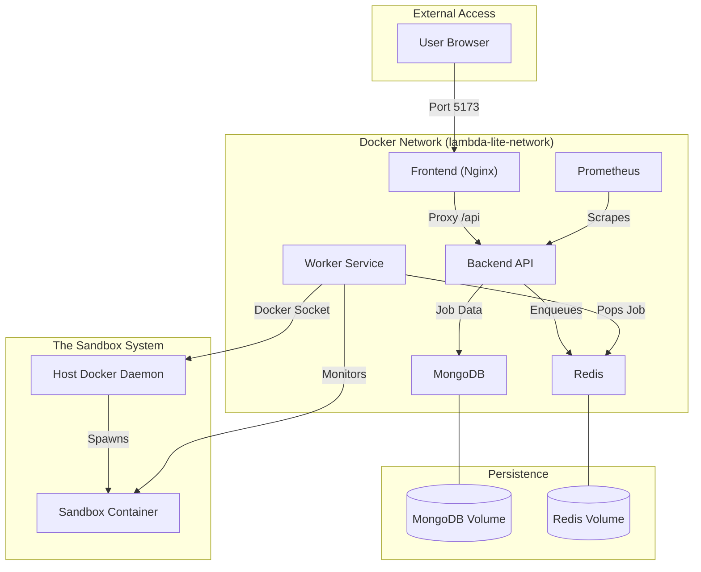

# Lambda Lite: Advanced Docker Deep-Dive 🐳

This guide moves beyond the basics to explain the professional-grade Docker architecture used in Lambda Lite. It is intended to build a deep mental model of how distributed systems are containerized.

---

## 🏗️ Visual Architecture

Understanding how the components interact is the first step to mastering Docker.



---

## 🔍 Deep Dive: Networking & Service Discovery

### The "Magic" of Service Names
Inside `docker-compose.yml`, every service has a name (e.g., `mongodb`). Docker runs an internal DNS server.
- When the Backend tries to connect to `mongodb://mongodb:27017`, Docker translates the word `mongodb` to the internal IP of that container (e.g., `172.18.0.2`).
- **Lesson**: Never hardcode IPs. Use Service Names.

### Internal vs. External Ports
Look at this mapping for the Backend:
```yaml
ports:
  - "8000:8000"
```
- **"8000" (Left)**: The port on your **Host Machine** (Laptop).
- **"8000" (Right)**: The port inside the **Container**.
- **Lesson**: Other containers in the same network can talk to `backend:8000` even if you remove the `ports` mapping! The `ports` entry is only for YOU (the user) to reach it from outside.

---

## ⚡ Deep Dive: Layer Caching & Build Performance

Docker builds are made of **layers**. If a layer hasn't changed, Docker reuses it from the cache. This is why we write Dockerfiles like this:

```dockerfile
# GOOD: Copying only package files first
COPY package.json yarn.lock ./
RUN yarn install  # This layer is cached as long as package.json stays the same

# THEN: Copying the rest of the code
COPY . .
RUN yarn build    # This layer is rebuilt every time you change a line of code
```

### Why this matters:
If you copied everything at once (`COPY . .`), every single code change would force `yarn install` to run again, wasting minutes. By separating them, `yarn install` is only triggered when you add a new library!

---

## 🛡️ Deep Dive: The Security Hierarchy

Lambda Lite uses **"Isolation in Depth"** to execute user code:

1.  **Level 1: Node.js VM**: The code is not run directly; it's run in a restricted Virtual Machine context where globals like `process`, `fs`, and `require` are deleted.
2.  **Level 2: Docker Container**: The entire process is wrapped in a container.
3.  **Level 3: Network Isolation**: The sandbox container has `NetworkMode: 'none'`. Even if a hacker escapes the VM, they can't send your data anywhere.
4.  **Level 4: Resource Limits**: We limit memory (512MB) and CPU (1 core). This prevents "Fork Bombs" or "Bitcoin Mining" from crashing your laptop.

---

## 📦 Deep Dive: Volumes & Data Persistence

Containers are **stateless**. When you delete a container, its files are gone.
We use **Named Volumes** for our database:

```yaml
volumes:
  - mongodb_data:/data/db
```

### Types of Mounts:
1.  **Named Volumes**: Managed by Docker. Best for databases (`/data/db`).
2.  **Bind Mounts**: You map a specific folder on your laptop (e.g., `./infra/redis.conf`) to the container. Best for configuration files.

---

## 🚀 Advanced Commands for Power Users

| Command | Why use it? |
|---------|-------------|
| `docker stats` | See the real-time CPU/RAM usage of all your containers. |
| `docker inspect <id>` | See the giant JSON configuration of a container (IPs, Env vars, etc). |
| `docker compose top` | See what processes are running inside your containers. |
| `docker network ls` | See the virtual networks Docker created for your project. |

---

**Mastery Challenge**: 
Go to `infra/docker-compose.yml`, change the external port of the frontend from `5173:80` to `3333:80`. Restart the stack. Can you still reach the app at `localhost:5173`? Why or why not? (Hint: check your browser at `localhost:3333`!)
