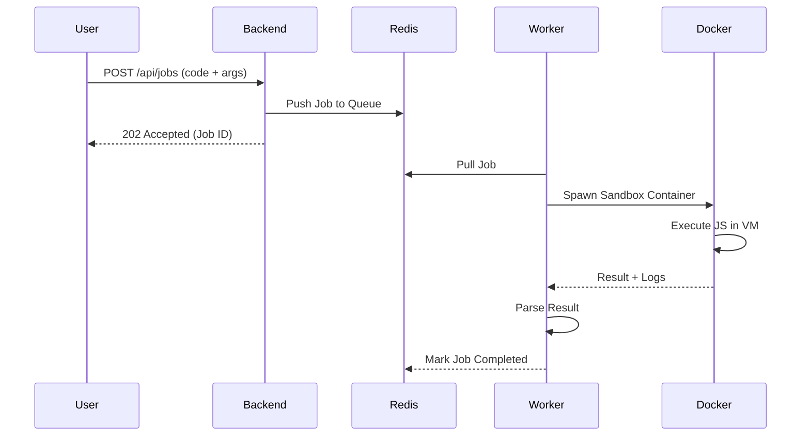

# Serverless Architecture: How Lambda-Lite Works

Lambda-Lite is a distributed task execution system inspired by the core principles of **AWS Lambda**. It allows users to execute code in a "serverless" fashion, meaning the user focuses on writing the logic (the function) without worrying about the underlying infrastructure or scaling.

---

## 🏗️ Core Architecture

The system follows a microservices pattern, decoupling job submission from job execution through a robust message queue.

### 1. Backend (The Gateway)
The `apps/backend` service acts as the entry point. When a job is submitted via the REST API:
- It validates the JavaScript code.
- It calculates the necessary resource limits.
- It pushes the job metadata into the **Redis Queue** using **BullMQ**.
- It returns a Job ID immediately, allowing for asynchronous processing.

### 2. Distributed Queue (The Orchestrator)
**Redis** and **BullMQ** form the backbone of the system:
- **Asynchronous**: It decouples the API from execution, ensuring the API remains responsive.
- **Persistence**: Jobs are stored in Redis until a worker is available.
- **Retries**: Automatically handles job failures based on configuration.

### 3. Worker (The Executor)
The `apps/worker` service is responsible for pulling jobs from the queue and executing them:
- **Lifecycle Management**: It spins up and tears down Docker containers for every single job.
- **Resource Enforcement**: It translates our job limits into Docker-level constraints.
- **Log Streaming**: It captures output from the sandbox and streams it back to the database and frontend.

### 4. Sandbox (The Fortress)
The most critical part of the serverless experience is **isolation**. Lambda-Lite uses a multi-layered security model:

| Layer | Technology | Purpose |
| :--- | :--- | :--- |
| **Containerization** | Docker | Provides process and OS-level isolation. |
| **Virtual Machine** | Node.js `vm` | Provides code-level isolation within the container. |
| **Privilege Control** | Docker Run Flags | Restricts network, filesystem, and CPU/Memory usage. |

---

## 🔒 Security & Sandboxing in Detail

How do we safely run untrusted code?

### Docker Isolation
Every execution runs in a fresh container (based on `docker/sandbox`) with strict flags:
- `--network=none`: Prevents the code from making external requests or accessing local network services.
- `--read-only`: The filesystem is immutable; code cannot save files or malicious binaries.
- `--memory`: Hard limit on RAM (e.g., 512MB).
- `--cpus`: Restricted CPU usage to prevent "noisy neighbor" issues.

### Node.js VM Module
Inside the container, the `runner.js` uses the `vm` module to create a "Frozen Realm":
- **Limited Globals**: Dangerous APIs like `fs`, `http`, and `child_process` are removed.
- **Context Isolation**: The user code cannot access the `runner.js` own variables or the global Node.js process.

---

## 🔄 The Request Lifecycle

---

## 📊 Comparison with AWS Lambda

| Feature | AWS Lambda | Lambda-Lite |
| :--- | :--- | :--- |
| **Execution Unit** | Function | Job |
| **Runtime** | MicroVM (Firecracker) | Docker Container |
| **Language Support** | Multiple (Node, Python, Go...) | JavaScript (Node.js) |
| **Trigger** | API Gateway, S3, SQS... | REST API |
| **Scaling** | Automatic (Global Scale) | Horizontal (Worker Scaling) |
| **State** | Stateless | Stateless |

---

## 🚀 Scaling and Performance

Lambda-Lite is designed to scale horizontally just like a real cloud provider.
- **Worker Scaling**: You can add 1, 10, or 100 workers simply by running more instances of the `apps/worker` service.
- **Queue Balancing**: Redis handles the distribution of jobs across all available workers automatically.
- **Concurrency**: Each worker can handle multiple jobs concurrently (configurable) by spawning separate Docker sandboxes.

---

> [!TIP]
> This project is a great way to understand the "under the hood" mechanics of cloud giants. It demonstrates that "Serverless" doesn't mean "no servers"—it means someone else (in this case, our Backend and Workers) is managing them for you!
